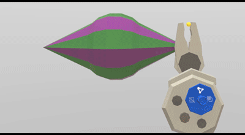

Experimental Features in Blocks
===============================

Environment Options
-------------------

You can pick from four modeling environments. there is a night version of the current environment for those who 
find the desert a bit too bright after long creation sessions.
You’ll also find plain white and black options. M
ake sure to look up while creating in the black environment for a night sky surprise. Plus, we’ll remember which environment you used in your last session and automatically default to that selection your next time around.

Improved Snapping
-----------------

The ability to snap objects, edges and vertices together helps make your creations precise. However, we heard that the existing snapping behavior was often unpredictable or difficult to control. To ensure every snap you make does what you expect it to do, we’ve vastly improved our snapping algorithm and introduced a brand new user experience to guide you.

When trying to snap two objects together, make sure to half-press the alternate trigger to see a helpful guide line. The line will preview the spot to which your object will snap if the trigger is fully pressed. Use this guide to locate your snapping gesture to the exact face you intend before pressing the trigger all the way down.

You can also more easily snap meshes together. Let’s say, for example, that you’d like to snap a torus around a cylinder. Half-press the alternate trigger while placing the torus to get helpful guidelines for placing one mesh around the other. Fully press the trigger to snap the torus in place.

**Labs, with Your Most-Requested Features**
-------------------------------------------

At the very bottom of your Blocks menu you'll now see a beaker icon which lets you access prototype versions of your most-asked-for features. Here’s a breakdown:

**Non-coplanar face mode****:** Many of you have noticed that Blocks will create coplanar faces when reshaping meshes. This is helpful in many cases, but in others it creates extraneous triangles that make further operations like perfect subdivision difficult. Now you can enable non-coplanar faces to avoid creation of extra triangles.

**Loop subdivide****:** Subdivision can be a really powerful tool. It’s even more powerful if you can cut a loop around an entire mesh. With loop subdivide enabled, simply long press on the trigger while subdividing to see a perfect subdivision loop form around your object.

**Edge, Face and Vertex Deletion****:** Many have asked for the ability to delete a single edge, face or vertex. With this feature enabled, use the eraser tool to do just that. We'll “collapse” the mesh based on the edge, face or vertex you delete.

**Worldspace grids****:** Another option that helps with precision is enabling worldspace grids. This feature will show grids along every side of your worldspace. The grid units are equivalent to the actual worldspace grid units, so you can precisely measure and place objects along the grids.

**Volume insertion ruler****:** Modeling very precisely in Blocks can be difficult without a sense of relative scale. This experimental feature allows you to enable a ruler when you are inserting a mesh. As you insert the object, you'll see relative measurements in meters appear on each axis so you can precisely and accurately measure every object relative to the others.

**Expanded mesh wireframe****:** When reshaping a mesh you see a helpful wireframe around the section of the mesh you are reshaping. Many have asked for the ability to turn that wireframe on for the entire mesh, and this feature does exactly that.

**Stepwise selection undo****:** Multi-selecting a lot of objects can be frustrating if you select the wrong object in the middle of your selection process. We wanted to make this easier, so we’ve experimented with allowing you to undo and redo steps in your multi-selection. You can use the undo and redo buttons on your non-dominant controller to undo or redo the selection of objects in order. Make sure to keep your trigger held down while undoing or redoing to ensure you can keep multi-selecting after correcting your mistake!

It’s important to note that since these features are experimental, there may be minor bugs or issues when using them.

    