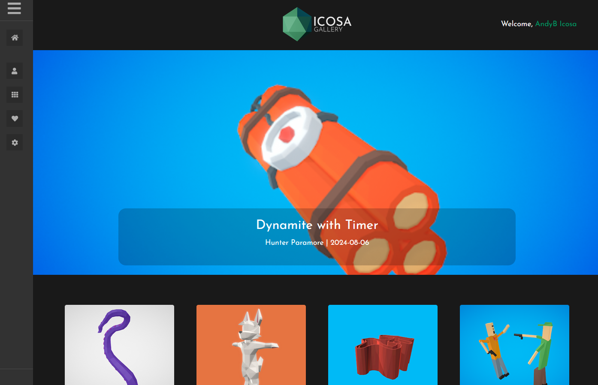

# Saving and Sharing on the Web


Coming Soon


<figure><figcaption></figcaption></figure>

When it was originally released - Google Blocks was designed to closely integrate with Google Poly - the 3d model sharing website by Google.

We have nearly finished work on a complete replacement - The Icosa Gallery which will be fully open source. You'll be able to save and publish your work and view or remix the work of others.

We hope to make a preview release of this functionality available in Q3 2024

